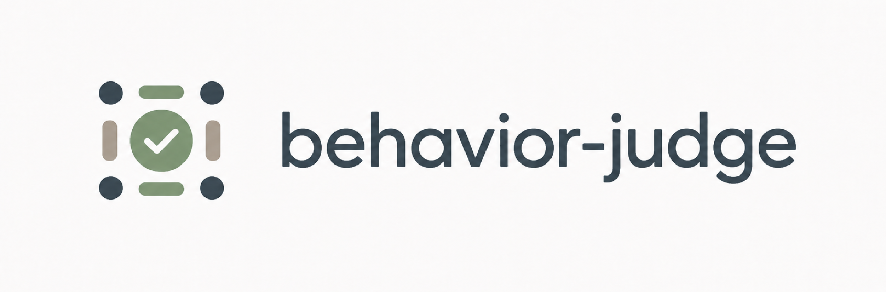

[GITHUB REPO status here]

Long-horizon agents are hard to evaluate. [Agent Behavior](https://github.com/braintrustdata/agentbehavior) specs tackle this by observing the process agents take to get to outcomes. `behavior-judge` compiles an Agent Behavior spec into an executable judge for long-horizon agent trajectories, with deterministic checks for most common agent behaviors.

## Why

Real-world tasks run for days or weeks, are not easily verifiable, and an agent can reach the right answer through the wrong process (i.e. a tax agent answering from pretraining instead of verifying
against primary sources still passes an outcome eval). The
[Agent Behavior standard](https://github.com/braintrustdata/agentbehavior), open-sourced
by [Braintrust](https://www.braintrust.dev) and [Basis](https://www.getbasis.ai/)
([launch thread](https://x.com/mitch_troy/status/2082513195357307158)), tackles this
with process supervision: write down how the agent should behave in a freeform
`BEHAVIOR.md` and ask a model to judge trajectories against it.

[DIAGRAM HERE of agent behavior data flow]

We notice a pattern: most behaviors we expect from long-horizon agents codify into a common set of checks over trajectory events. For example, checking the agent does X before Y, or ensuring the agent never does X. 

[DIAGRAM HERE of most common checks]

`behavior-judge` builds on the Agent Behavior project by taking a behavior spec + agent trajectories as input and compiling them into a YAML representation of deterministic rules. Judging becomes more consistent from run to run, with the LLM confined to the few narrowly scoped checks that need semantic judgement. Every verdict is backed with evidence from the spec and trajectory events.

[DIAGRAM HERE of behavior-judge data flow]

Codifying semantic judges into deterministic checks can help make the loops that evaluate and improve agents become more easily verifiable.

## The checks

A compiled judge is a list of rules, each with a **trigger** ("does this rule apply
here at all?") and two kinds of checks:

- **Five deterministic predicates** over trajectory events: `ordering` (X before Y),
  `pairing` (every X later followed by Y), `required`, `forbidden`, and `count`
  (min/max, optionally over distinct values), plus an `after:` scope for "once X
  happens…" clauses.
- **Semantic checks**: one narrowly scoped LLM question per clause that no event
  pattern can express ("does the answer rely on the source it read?").

## Running `behavior-judge`

### Install and build

Requires Node ≥ 20 and [pnpm](https://pnpm.io).

```console
$ pnpm install
$ pnpm build              # → dist/; run the CLI as `node dist/cli.mjs`
$ pnpm link --global      # optional: puts `behavior-judge` on your PATH
```

LLM calls go through the
[Braintrust Gateway](https://www.braintrust.dev/docs/guides/proxy): put
`BRAINTRUST_API_KEY` in a `.env` at the repo root (the model defaults to `gpt-5-mini`;
override with `BRAINTRUST_MODEL`).

### Generate a judge from behavior spec

```
behavior-judge generate  <behavior-path> <trajectory.json ...> [--out <file>]
```

Reads your behavior spec + sample trajectories to determine how to compile your desired agent behaviors to deterministic checks. It then drafts a judge and runs an in-browser interview with you to confirm the relevant checks and event vocabulary your trajectories actually use. Writes `judge.yaml` next to the spec.

[SCREENSHOT OF THE GENERATE PAGE]

### Run the judge on agent trajectories

```
behavior-judge judge  <ir.yaml> <trajectory.json ...> [--json]
```

Runs a judge over trajectories. Deterministic checks are free; the LLM handles semantic clauses + confirming failures of any deterministic checks. The report renders in your browser by default.

[SCREENSHOT OF THE JUDGE REPORT]

### Update the judge after behavior spec changes

```
behavior-judge generate  --update judge.yaml <behavior-path> <trajectory.json ...>
```

After a spec edit, re-interviews only what changed; unchanged sections carry over.

### Calibrate the judge

```
behavior-judge calibrate <ir.yaml> <trajectory.json ...> [--json]
```

Compare the judge's verdicts against labeled trajectories (`{trajectory, expected}` files) and exits non-zero on any disagreement.

## Examples

Three ready-to-run examples live under [`examples/`](examples/), each with a
`BEHAVIOR.md`, a checked-in `judge.yaml`, and labeled trajectories:

- [`primary-source-tax-research/`](examples/primary-source-tax-research/) — A tax research agent, derived from the Agent Behavior repo.
- [`verified-refund-support/`](examples/verified-refund-support/) — deterministic-only; A
  support agent that must verify identity before account changes, log every refund, and
  never touch a full card number.
- [`staged-rollout-deploys/`](examples/staged-rollout-deploys/) — deterministic-only; An
  SRE agent that must canary before fleet-wide deploys and respect change freezes.

```console
$ behavior-judge judge examples/primary-source-tax-research/judge.yaml \
    examples/primary-source-tax-research/trajectories/skill-read-too-late.json
```

## What a compiled judge looks like

The reference IR for the tax-research example (trimmed):

```yaml
version: 1
behavior: primary-source-tax-research
metaBehaviors:
  - name: Read the tax research skill before beginning source research
    trigger:
      description: The agent begins source research.
      match: # deterministic trigger, any-of
        - action: web_search
        - action: open_url
    checks:
      - type: ordering
        quote: the agent first reads the tax research skill, before searching or opening a source
        first: { action: read_skill }
        before: [{ action: web_search }, { action: open_url }]
  - name: Consult primary sources before answering
    trigger:
      description: The agent answers a tax question.
      semantic: true # no event pattern can detect "tax question" — one scoped LLM call
    checks:
      - type: ordering
        quote: Before deciding on the answer, it reads the relevant primary source
        first: { action: open_url_result, metadata: { sourceType: primary } }
        before: { action: final_answer }
    semanticChecks:
      - quote: bases its conclusion on that source
        question: Does the final answer base its conclusion on the primary source the agent read?
```

Every check carries a verbatim `quote` from the spec, so every verdict traces to the
clause it enforces. Full predicate semantics, the judging pipeline, the browser
frontends, and library usage are documented in [docs/DETAILS.md](docs/DETAILS.md).

## License

Apache-2.0 (see [LICENSE](LICENSE)), same as the upstream Agent Behavior repo. The
example spec, the tax fixture data, and the gateway client derive from that repo's
examples.
